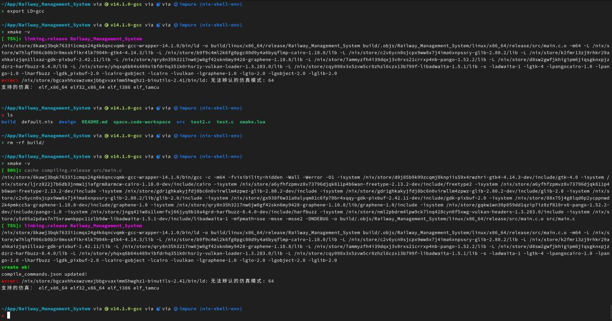
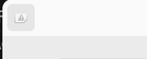

# 地铁管理系统

# Todo
- [ ] 尝试实现一个数据模型
- [ ] 尝试将数据模型绑定到 List
- [ ] 尝试建立自定义dialog

# 异常分析
## NixOS 下xmake无法链接程序


在梓瑶的帮助下排查出了一个 xmake 编译错误(用xmake编译gtk4项目)，找出来的原因是：在nixos 24.05系统中临时添加任意一个nix包到环境，就会在环境变量里面增加 LD="ld" 的环境变量。这个变量造成了xmake编译的故障。

> 梓瑶原话：以及这说明 xmake 期待的 ld 是 CCLD 而不是 LD.....

在 NixOS C 环境配置文档[^1]中提到这个做法

```shell
nix-shell -p hello --command 'which $LD'
```
事实上，在 NixOS 中，一旦环境组装完成，就会诞生 $LD 环境变量（经过测试，似乎所有包引入时都会诞生该变量），该变量记录了该环境中最合适的 LD 工具（通常由 binutils 提供）。不巧的是，xmake 中参与链接的并不是标准 LD ，而是 CCLD ，在其他发行版中，环境变量中没有 $LD ，所以 xmake 会使用缺省值，自动使用 CCLD 路径。而 NixOS 中，$LD 已经被指定，所以引起了链接失败。

知道问题，也就好办了，hook一下shell，加一个 unset LD 就可以了。

```nix
{
  description = "RMS build environment";

  inputs = {
    nixpkgs.url = "github:nixos/nixpkgs/nixos-24.05";
  };

  outputs = { self , nixpkgs ,... }: let
    system = "x86_64-linux";
  in {
    devShells."${system}".default = let
      pkgs = import nixpkgs {
        inherit system;
      };
    in pkgs.mkShell {
      packages = with pkgs; [
        gtk4
        libadwaita
        gnome.adwaita-icon-theme
        pkg-config
        xmake
        clang-tools
        llvmPackages_18.clangUseLLVM
        wrapGAppsHook4
      ];
      shellHook = ''
        unset LD
      '';
    };
  };
}
```
hook的语句就是：
```nix
shellHook = ''
    unset LD
'';
```

## NixOS 下内建图标显示异常


这个问题从第一次成功显示界面就存在，起初觉得是 NixOS 的设计缺陷引起，但是在解决 `NixOS 下xmake无法链接程序` 这个问题以后，受到启发，觉得可能是 NixOS 设计了特殊的环境变量或者Hook，而我没有引入，从而使程序无法寻找到正确的资源。

我测试的方法很简单，我找到了一个同样在 NixOS 平台编译且使用 flake 管理编译环境的项目。尽管是 Rust 项目，不过根据我的推测，引入的环境应该和 C 项目是相同的。我尝试将该项目[^2]的 flake.nix 中的依赖全部复制到我的项目的 flake.nix 中。经测试，编译后的程序可以正常显示内建图标，这说明我的猜想是正确的。

接下来就是二分法找依赖（将这些依赖中的一半复制进去，刷新 direnv 缓存，看看重新编译后的程序是否依然可以正常显示，以此类推，二分寻找）。最终锁定到 `wrapGAppsHook4` 这个特殊的依赖项。

官方资料[^3]对此做出了解答：

> Programs in the GNOME universe are written in various languages but they all use GObject-based libraries like GLib, GTK or GStreamer. These libraries are often modular, relying on looking into certain directories to find their modules. However, due to Nix’s specific file system organization, this will fail without our intervention. Fortunately, the libraries usually allow overriding the directories through environment variables, either natively or thanks to a patch in nixpkgs. Wrapping the executables to ensure correct paths are available to the application constitutes a significant part of packaging a modern desktop application.

> wrapGAppsHook itself will add the package’s share directory to XDG_DATA_DIRS.

# 参考文献

[^1]: https://nixos.wiki/wiki/C

[^2]: https://github.com/snowfallorg/nix-software-center/blob/main/flake.nix

[^3]: https://ryantm.github.io/nixpkgs/languages-frameworks/gnome/#ssec-gnome-hooks